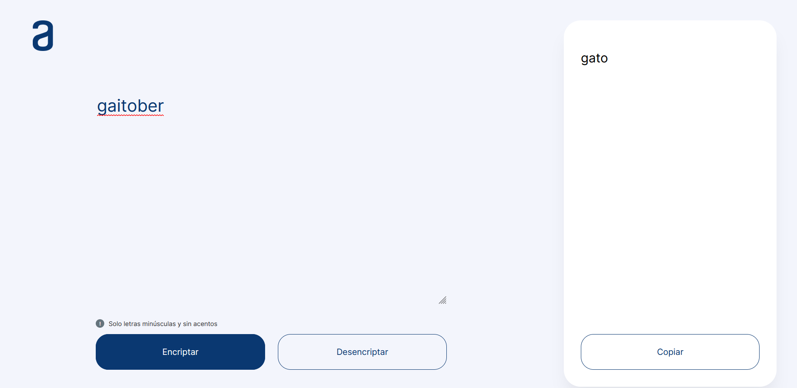
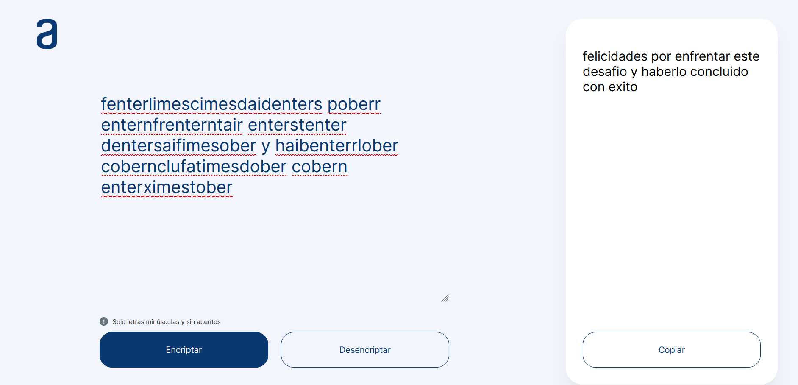

# Encriptador de Texto

Este proyecto es una aplicación web simple que permite encriptar y desencriptar texto según reglas específicas. La aplicación también incluye funcionalidades para copiar el texto encriptado o desencriptado al portapapeles y valida que la entrada contenga solo letras minúsculas y espacios.

## Características

- **Encriptar texto**: Convierte las letras según las siguientes reglas:

  - `e` se convierte en `enter`
  - `i` se convierte en `imes`
  - `a` se convierte en `ai`
  - `o` se convierte en `ober`
  - `u` se convierte en `ufat`
- **Desencriptar texto**: Reconvierte el texto encriptado a su forma original.
- **Copiar texto**: Permite copiar el texto encriptado o desencriptado al portapapeles.
- **Validación de entrada**: Asegura que solo se ingresen letras minúsculas y espacios en el textarea.

## Requisitos

- Navegador web moderno (Chrome, Firefox, Safari, Edge)

## Instalación

1. Clona este repositorio:

   ```bash
   git clone https://github.com/soularius/ONE-ORACLE-CHALLENGE-1.git
   ```
2. Navega hasta el directorio del proyecto:

   ```bash
   cd ONE-ORACLE-CHALLENGE-1
   ```
3. Abre el archivo `index.html` en tu navegador.

## Uso

1. Ingrese el texto que desea encriptar en el textarea.
2. Haga clic en el botón **Encriptar** para encriptar el texto.
3. El texto encriptado aparecerá en la sección de salida.
4. Haga clic en el botón **Desencriptar** para desencriptar el texto.
5. Para copiar el texto encriptado o desencriptado, haga clic en el botón **Copiar**.

## Estructura del Proyecto

encriptador-texto/

├── assets/

│ ├── css/

│ │ ├── style.css

│ │ ├── fonts.css

│ ├── js/

│ │ ├── script.js

│ ├── fonts/

│ │ ├── inter/*

│ ├── img/

│ │ ├── logo.png

│ │ └── muneco.png

└── index.html

## Capturas

### En espera


### Texto Encriptado


### Texto desencriptado



### Copiando Texto


### Desencriptando el mensaje secreto


